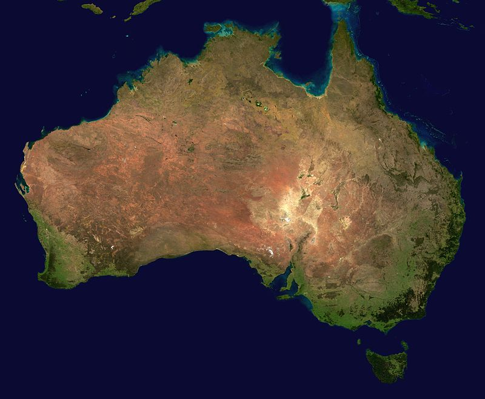

# mosaic
Make a mosaic of a master image, using as tiles images coming from a given collection.

## How to use
Add images to the "images folder" to be used as tiles in the mosaic. You can also add folders containing images.

Add a master image to the "master folder". 

In the Python console, with as current directory the folder containing `mosaic.py`, import the file and start a mosaic project,
```
import mosaic
mos = mosaic.MosaicProject(height=100, width=120)
```
The height and width parameter are optional and determine the height and width of the tiles in the mosaic.

Then make a mosaic
```
mos.make_mosaic(max_im=0, tuning=None)
```
which builds a mosaic and saves it in the "output folder".
Here max_im and tuning are optional parameters.

### max_im
Suppose there are 1300 images in the "image folder". You might want to make a mosaic using merely a 1000 of them. Then use
```
mos.make_mosaic(max_im=1000, tuning=None)
```
### tuning
Tuning basically means colour shifting the mosaic towards to the master image.
The options are tuning="tuning_1", tuning="tuning_2" or custom tuning. For example,
```
mos.make_mosaic(max_im=0, tuning="tuning_1")
```
yields a slight shift towards the master image, and tuning="tuning_2" yields a more severe shift.
For custom tuning, please have a look at TUNING_README.MD.

## example
I placed 1210 Australian wildlife images in the "images folder" and the following image in the master folder.



I then imported the mosaic module, started a mosaic project and made a mosaic,
```
import mosaic
mos = mosaic.MosaicProject()
mos.make_mosaic(max_im=1140, tuning="tuning_2")
```
which yielded the following mosaic in the output folder.


## printing another mosaic
Continuing on the example above, to print another mosaic, for example with tuning = "tuning_1", run
```
mos.print_mosaic(tuning="tuning_1")
```

## manual building of mosaic
The make_mosaic method does three things:  
(1) crop and resize each image in the "images folder" and save it to the "library folder".  
(2) process master image in "master folder" and find optimal assignment of library images to tiles in mosaic.  
(3) print a mosaic, optionally with some tuning.

One can also do these steps manually. For instance, to do the above example manually, import mosaic and start a project
```
import mosaic
mos = mosaic.MosaicProject()
```
Build a library
```
mos.build_library()
```
Process master image
```
mos.process_master(max_im=1140)
```
Print a mosaic
```
mos.print_mosaic(tuning="tuning_2")
```

Say, you want to choose a different master image, then just place it in the master folder and repeat the last two steps.

## continuing an old mosaic project
Suppose a mosaic project already exists. To continue with it, import mosaic and start a project
```
import mosaic
mos = mosaic.MosaicProject()
```
The user is then prompted to either continue the old project or start a new one and clear the old one.
Select continue old project.


